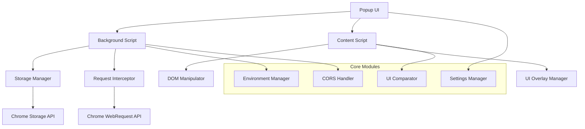

# 设计文档

## 概述

前端开发 Chrome 扩展程序是一个基于 Manifest V3 的现代化开发工具，为前端开发者提供环境变量管理、跨域请求处理和 UI 稿比对等核心功能。该扩展程序采用模块化架构设计，确保各功能模块之间的解耦和可维护性。

## 技术栈

- **Manifest 版本**: Manifest V3
- **前端框架**: React 18 + TypeScript
- **构建工具**: Vite + Chrome Extension Plugin
- **样式方案**: Tailwind CSS + CSS Modules
- **状态管理**: Zustand (轻量级状态管理)
- **UI 组件库**: Ant Design (适配扩展程序样式)
- **文件处理**: File API + FileReader
- **图片处理**: Canvas API + Image Manipulation
- **存储方案**: Chrome Storage API (sync + local)

## 架构设计

### 整体架构



### 文件结构

```
src/
├── manifest.json
├── background/
│   ├── index.ts                 # Service Worker入口
│   ├── environmentManager.ts    # 环境变量管理
│   ├── corsHandler.ts          # 跨域处理
│   └── requestInterceptor.ts   # 请求拦截器
├── content/
│   ├── index.ts                # Content Script入口
│   ├── uiComparator.ts         # UI比对功能
│   ├── domInjector.ts          # DOM注入器
│   └── overlayManager.ts       # 覆盖层管理
├── popup/
│   ├── index.tsx               # Popup入口
│   ├── components/             # React组件
│   │   ├── EnvironmentPanel.tsx
│   │   ├── CorsPanel.tsx
│   │   ├── UIComparatorPanel.tsx
│   │   └── SettingsPanel.tsx
│   └── hooks/                  # 自定义Hooks
├── shared/
│   ├── types.ts                # TypeScript类型定义
│   ├── constants.ts            # 常量定义
│   ├── utils.ts                # 工具函数
│   └── storage.ts              # 存储工具
└── assets/
    ├── icons/                  # 扩展图标
    └── styles/                 # 全局样式
```

## 组件和接口设计

### 1. 环境变量管理模块

#### 接口定义

```typescript
interface EnvironmentVariable {
  key: string;
  value: string;
  enabled: boolean;
  domain?: string;
}

interface EnvironmentConfig {
  variables: EnvironmentVariable[];
  globalEnabled: boolean;
  autoInject: boolean;
}

interface EnvironmentManager {
  loadFromFile(file: File): Promise<EnvironmentVariable[]>;
  addVariable(variable: EnvironmentVariable): void;
  removeVariable(key: string): void;
  toggleVariable(key: string): void;
  injectToPage(tabId: number): Promise<void>;
  getConfig(): Promise<EnvironmentConfig>;
  saveConfig(config: EnvironmentConfig): Promise<void>;
}
```

#### 核心功能

- **.env 文件解析**: 使用正则表达式解析标准.env 格式
- **变量注入**: 通过 Content Script 将变量注入到 window 对象
- **域名绑定**: 支持为不同域名配置不同的环境变量
- **持久化存储**: 使用 Chrome Storage API 保存配置

### 2. 跨域请求处理模块

#### 接口定义

```typescript
interface CorsConfig {
  enabled: boolean;
  allowedOrigins: string[];
  allowedMethods: string[];
  allowedHeaders: string[];
  credentials: boolean;
}

interface CorsHandler {
  enable(): Promise<void>;
  disable(): Promise<void>;
  updateConfig(config: CorsConfig): Promise<void>;
  getStatus(): Promise<boolean>;
}
```

#### 核心功能

- **请求拦截**: 使用 chrome.webRequest API 拦截 HTTP 请求
- **响应头修改**: 动态添加 CORS 相关响应头
- **白名单管理**: 支持配置允许跨域的域名列表
- **状态监控**: 实时显示跨域请求的处理状态

### 3. UI 稿比对模块

#### 接口定义

```typescript
interface UIOverlay {
  id: string;
  imageUrl: string;
  position: { x: number; y: number };
  size: { width: number; height: number };
  opacity: number;
  visible: boolean;
  locked: boolean;
}

interface UIComparator {
  uploadImage(file: File): Promise<string>;
  createOverlay(imageUrl: string): Promise<UIOverlay>;
  updateOverlay(id: string, updates: Partial<UIOverlay>): void;
  removeOverlay(id: string): void;
  toggleVisibility(id: string): void;
  adjustBrowserSize(width: number, height: number): Promise<void>;
  saveConfiguration(url: string, overlays: UIOverlay[]): Promise<void>;
  loadConfiguration(url: string): Promise<UIOverlay[]>;
}
```

#### 核心功能

- **图片上传处理**: 支持拖拽上传和文件选择
- **覆盖层渲染**: 使用 CSS 绝对定位创建可交互覆盖层
- **交互控制**: 支持拖拽、缩放、透明度调整
- **窗口控制**: 通过 chrome.windows API 调整浏览器窗口尺寸

## 数据模型

### 存储结构

```typescript
// Chrome Storage Schema
interface ExtensionStorage {
  // 环境变量配置
  environments: {
    [domain: string]: EnvironmentConfig;
  };

  // 跨域配置
  corsSettings: CorsConfig;

  // UI比对配置
  uiComparisons: {
    [url: string]: {
      overlays: UIOverlay[];
      browserSize?: { width: number; height: number };
    };
  };

  // 全局设置
  globalSettings: {
    theme: "light" | "dark";
    language: "zh" | "en";
    shortcuts: { [action: string]: string };
  };
}
```

### 消息传递协议

```typescript
// Background <-> Content Script 通信
interface MessageProtocol {
  // 环境变量相关
  INJECT_ENVIRONMENT: {
    type: "INJECT_ENVIRONMENT";
    payload: EnvironmentVariable[];
  };

  // UI比对相关
  CREATE_OVERLAY: {
    type: "CREATE_OVERLAY";
    payload: UIOverlay;
  };

  UPDATE_OVERLAY: {
    type: "UPDATE_OVERLAY";
    payload: { id: string; updates: Partial<UIOverlay> };
  };

  // 跨域状态更新
  CORS_STATUS_CHANGED: {
    type: "CORS_STATUS_CHANGED";
    payload: { enabled: boolean };
  };
}
```

## 错误处理

### 错误分类和处理策略

1. **文件处理错误**

   - .env 文件格式错误: 显示具体行号和错误原因
   - 图片文件格式不支持: 提示支持的格式列表
   - 文件大小超限: 显示最大文件大小限制

2. **权限错误**

   - 跨域请求被阻止: 提供权限申请指导
   - 存储空间不足: 提示清理建议

3. **网络错误**

   - API 请求失败: 显示重试选项
   - 图片加载失败: 提供本地缓存机制

4. **兼容性错误**
   - Chrome 版本过低: 显示最低版本要求
   - API 不支持: 提供降级方案

### 错误恢复机制

```typescript
interface ErrorHandler {
  handleError(error: ExtensionError): void;
  showNotification(message: string, type: "error" | "warning" | "info"): void;
  logError(error: Error, context: string): void;
  recoverFromError(errorType: string): Promise<boolean>;
}
```

## 测试策略

### 单元测试

- **工具函数测试**: 使用 Jest 测试环境变量解析、文件处理等工具函数
- **组件测试**: 使用 React Testing Library 测试 UI 组件
- **API 测试**: Mock Chrome APIs 进行功能测试

### 集成测试

- **扩展程序加载测试**: 验证 manifest.json 配置正确性
- **消息传递测试**: 测试 Background Script 和 Content Script 之间的通信
- **存储功能测试**: 验证数据持久化和同步功能

### 端到端测试

- **功能流程测试**: 使用 Puppeteer 模拟用户操作流程
- **跨浏览器测试**: 在不同 Chrome 版本中测试兼容性
- **性能测试**: 监控内存使用和响应时间

### 测试环境配置

```typescript
// jest.config.js
module.exports = {
  preset: "ts-jest",
  testEnvironment: "jsdom",
  setupFilesAfterEnv: ["<rootDir>/src/test/setup.ts"],
  moduleNameMapping: {
    "^@/(.*)$": "<rootDir>/src/$1",
  },
  collectCoverageFrom: [
    "src/**/*.{ts,tsx}",
    "!src/**/*.d.ts",
    "!src/test/**/*",
  ],
};
```

## 性能优化

### 内存管理

- **图片缓存策略**: 使用 LRU 缓存限制内存使用
- **DOM 节点清理**: 及时清理不需要的覆盖层元素
- **事件监听器管理**: 避免内存泄漏

### 加载优化

- **代码分割**: 按功能模块分割代码，按需加载
- **资源压缩**: 使用 Vite 进行代码压缩和优化
- **懒加载**: 大文件和图片采用懒加载策略

### 用户体验优化

- **响应式设计**: 适配不同屏幕尺寸
- **快捷键支持**: 提供常用功能的快捷键
- **状态持久化**: 保存用户的操作状态和偏好设置
